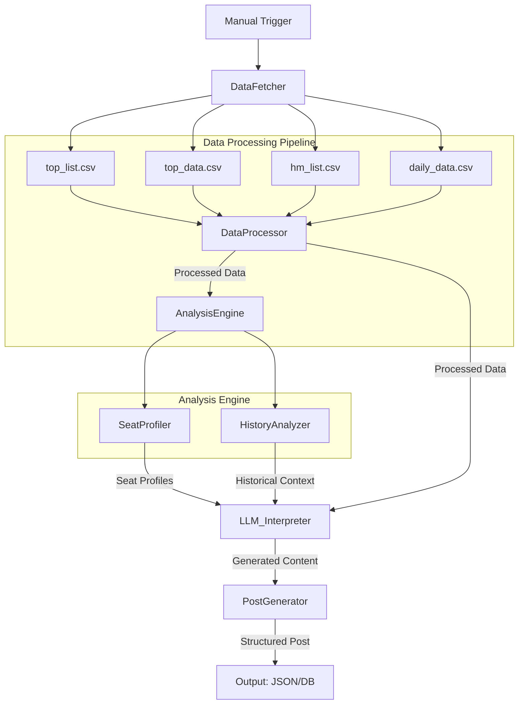
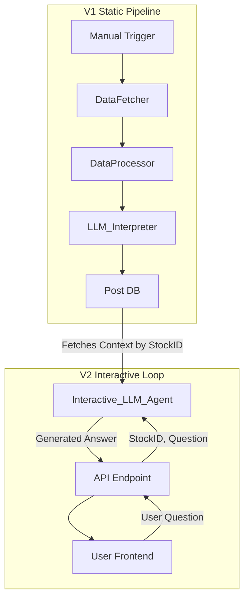
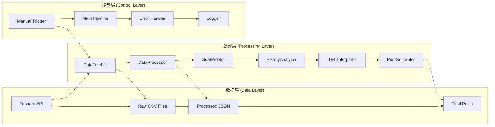
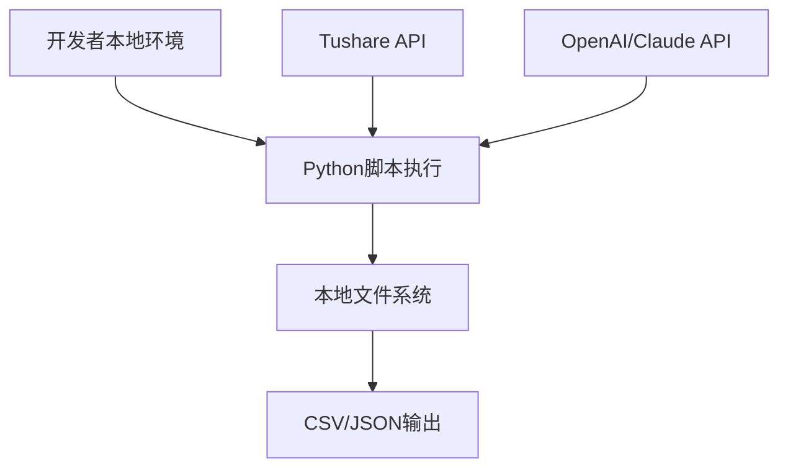
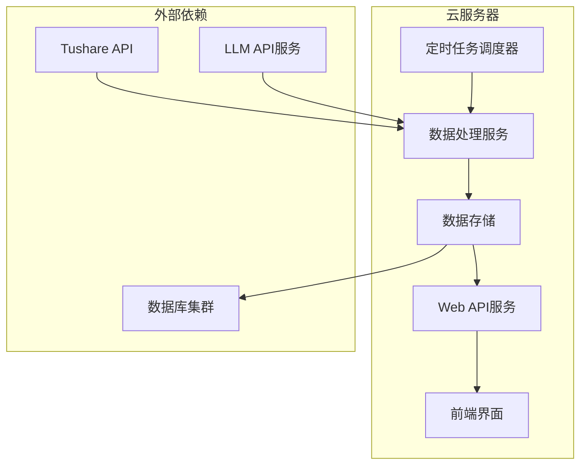

# Gushen AI - 工程与数据结构设计 (ERD)

### 版本历史
| 版本 | 日期       | 作者 | 变更内容                               |
| :--- | :--------- | :--- | :------------------------------------- |
| V1.3 | 2025-01-XX | AI   | 完善字段单位标识规范, 百分比加"%", 成交量改为"万手" |
| V1.2 | 2024-12-27 | AI   | 重构数据清洗规范, 新增系统化清洗标准    |
| V1.1 | 2024-07-25 | AI   | 移除Scheduler, 移除强度分, 更新数据结构 |
| V1.0 | 2024-07-25 | AI   | 初版创建                               |

---

## 1. 系统架构 (System Architecture)

本系统将采用模块化的手动触发流水线架构，确保各部分职责清晰、易于维护和扩展。



### 1.1. 核心模块拆解

1.  **DataFetcher**:
    - **职责**: 负责从各种数据源获取原始数据（调取tushare api）。
    - **实现**: 编写独立的Python脚本或函数，用于读取CSV文件。
2.  **DataProcessor**:
    - **职责**: 对原始数据进行清洗、格式化、合并。例如，将不同文件中的数据按股票代码和日期对齐。
    - **输出**: 生成标准化的、可供下游分析的DataFrame或JSON对象。
3.  **SeatProfiler (席位画像)**:
    - **职责**: 关联`hm_list.csv`，识别席位身份和风格。
    - **输入**: `top_data.csv`中的营业部名称。
    - **输出**: 为每个席位附加身份标签和风格。
4.  **HistoryAnalyzer (历史分析)**:
    - **职责**: 关联`daily_data.csv`，为每只上榜股票标注历史龙虎榜记录，生成历史行为分析所需的数据视图。
    - **输入**: 上榜股票代码、日期范围。
    - **输出**: 包含K线和上榜标记的数据集。
5.  **LLM_Interpreter (AI解读引擎)**:
    - **职责**: 核心AI模块。接收所有处理好的数据，通过精心设计的Prompt，调用大语言模型生成所有文本内容。
    - **输出**: 结构化的文本，包括核心摘要、战局解读、后市推演等。
6.  **PostGenerator (帖子生成器)**:
    - **职责**: 将LLM生成的文本内容与结构化数据组装成最终的帖子格式。
    - **输出**: 一个完整的、可供发布到前端或数据库的JSON对象。

### 1.2. V2 架构设想 (交互式查询)


## 1.3. 项目架构 (Project Architecture)

### 1.3.1. 项目目录结构

```
dragon & tiger/
├── 📁 core/                          # 核心业务模块
│   ├── data_fetcher.py               # ✅ 数据获取器 (已完成)
│   ├── data_processor.py             # ✅ 数据处理器 (已完成)  
│   ├── seat_profiler.py              # 🔄 席位画像分析器 (开发中)
│   ├── history_analyzer.py           # ⏳ 历史分析引擎 (待开发)
│   ├── llm_interpreter.py            # ⏳ AI解读引擎 (待开发)
│   └── post_generator.py             # ⏳ 帖子生成器 (待开发)
│
├── 📁 data/                          # 数据文件目录
│   ├── raw/                          # 原始数据
│   │   ├── top_list.csv              # 龙虎榜日榜单
│   │   ├── top_data.csv              # 个股席位数据
│   │   ├── hm_list.csv               # 游资名人录
│   │   └── daily_data.csv            # 日K线数据
│   ├── processed/                    # 处理后数据
│   │   └── processed_data.json       # 标准化数据输出
│   └── output/                       # 最终输出
│       └── posts/                    # 生成的帖子内容
│
├── 📁 config/                        # 配置文件
│   ├── api_config.py                 # API配置
│   ├── llm_prompts.py                # LLM提示词模板
│   └── business_rules.py             # 业务规则配置
│
├── 📁 utils/                         # 工具库
│   ├── logger.py                     # 日志工具
│   ├── validator.py                  # 数据验证器
│   └── common.py                     # 通用工具函数
│
├── 📁 tests/                         # 测试文件
│   ├── test_data_fetcher.py          # 数据获取测试
│   ├── test_data_processor.py        # 数据处理测试
│   └── integration_tests.py          # 集成测试
│
├── 📁 docs/                          # 文档目录
│   ├── api_reference.md              # API参考文档
│   ├── user_guide.md                 # 用户指南  
│   └── .cursor/erd.md                # 系统架构设计文档
│
├── 📁 龙虎榜系统设计方案/            # 产品设计方案
│   ├── Claude.md                     # Claude方案
│   ├── Gemini.md                     # Gemini方案
│   ├── o3.md                         # O3方案
│   └── prd.md                        # 产品需求文档
│
├── requirements.txt                  # Python依赖
├── main.py                          # 主程序入口
└── README.md                        # 项目说明
```

### 1.3.2. 模块开发状态与技术实现

| 模块名称 | 开发状态 | 技术栈 | 核心功能 | 输入 | 输出 |
|---------|---------|-------|---------|------|------|
| **DataFetcher** | ✅ 已完成 | Python + Tushare API | 数据获取与验证 | API调用参数 | 标准化CSV文件 |
| **DataProcessor** | ✅ 已完成 | Python + pandas | 数据清洗与格式化 | 原始CSV文件 | 结构化JSON数据 |
| **SeatProfiler** | 🔄 开发中 | Python + 正则匹配 | 席位身份识别 | 席位名称 + 游资名人录 | 玩家画像数据 |
| **HistoryAnalyzer** | ⏳ 待开发 | Python + numpy | 历史行为分析 | K线数据 + 上榜记录 | 趋势分析报告 |
| **LLM_Interpreter** | ⏳ 待开发 | Python + OpenAI/Claude API | AI内容生成 | 结构化数据 + 提示词 | 智能分析文本 |
| **PostGenerator** | ⏳ 待开发 | Python + Jinja2 | 内容组装发布 | 分析文本 + 数据 | 完整帖子JSON |

### 1.3.3. 技术栈与依赖

#### 核心技术栈
- **后端语言**: Python 3.9+
- **数据处理**: pandas, numpy, json
- **API调用**: tushare, requests  
- **AI模型**: OpenAI GPT-4 / Anthropic Claude
- **日志记录**: Python logging
- **测试框架**: pytest

#### 关键依赖包
```python
# requirements.txt 核心依赖
tushare>=1.2.89          # 金融数据接口
pandas>=2.0.0            # 数据处理
numpy>=1.24.0            # 数值计算
openai>=1.0.0            # OpenAI API
anthropic>=0.8.0         # Claude API
jinja2>=3.1.0            # 模板引擎
pytest>=7.0.0            # 测试框架
requests>=2.28.0         # HTTP客户端
python-dotenv>=1.0.0     # 环境变量管理
```

### 1.3.4. 数据流转架构



### 1.3.5. 部署架构设计

#### V1.0 本地开发架构


#### V2.0 生产部署架构 (规划)


### 1.3.6. 开发路线图

#### 阶段一：数据基础设施 (已完成 ✅)
- [x] 数据获取模块 (DataFetcher)
- [x] 数据处理模块 (DataProcessor)
- [x] 数据清洗规范制定
- [x] 基础测试用例编写

#### 阶段二：分析引擎开发 (当前阶段 🔄)
- [ ] 席位画像分析器 (SeatProfiler)
- [ ] 历史行为分析器 (HistoryAnalyzer)  
- [ ] 游资识别算法优化
- [ ] 技术指标计算模块

#### 阶段三：AI内容生成 (下一阶段 ⏳)
- [ ] LLM提示词工程
- [ ] AI解读引擎 (LLM_Interpreter)
- [ ] 内容模板设计
- [ ] 帖子生成器 (PostGenerator)

#### 阶段四：系统集成与优化 (未来规划 📋)
- [ ] 端到端流水线集成
- [ ] 性能优化与监控
- [ ] 错误处理与重试机制
- [ ] 用户交互界面开发

### 1.3.7. 质量保证体系

#### 代码质量标准
- **编码规范**: PEP 8 Python编码标准
- **文档要求**: 每个模块必须包含详细文档字符串
- **测试覆盖**: 核心模块测试覆盖率 > 80%
- **代码审查**: 关键模块需要进行代码审查

#### 数据质量保证
- **数据验证**: 每个数据处理步骤都包含数据验证
- **异常处理**: 完善的异常捕获和处理机制
- **日志记录**: 详细的处理日志便于问题排查
- **回测验证**: 定期对分析结果进行回测验证

## 2. 数据结构设计 (Data Schema)

### 2.1. 输入数据源 (CSV Schemas based on data-test.ipynb)

-   **`hm_list.csv` (游资名人录)**
    -   `name` (string): 游资/机构名称 (e.g., "龙飞虎")
    -   `desc` (string): 风格描述
    -   `orgs` (string): 关联的席位列表 (e.g., "['华泰证券股份有限公司南京六合雄州西路证券营业部']")

-   **`top_list.csv` (龙虎榜每日列表)**
    -   `trade_date` (string): 交易日期 (e.g., "20250617")
    -   `ts_code` (string): Tushare代码 (e.g., "000525.SZ")
    -   `name` (string): 股票名称
    -   `close` (float): 收盘价
    -   `pct_change` (float): 涨跌幅
    -   `turnover_rate` (float): 换手率
    -   `amount` (float): 总成交额(元)
    -   `l_sell` (float): 龙虎榜卖出额(元)
    -   `l_buy` (float): 龙虎榜买入额(元)
    -   `l_amount` (float): 龙虎榜总成交额(元)
    -   `net_amount` (float): 净买入额(元)
    -   `net_rate` (float): 净买入占比(%)
    -   `amount_rate` (float): 龙虎榜成交额占比(%)
    -   `float_values` (float): 流通市值(元)
    -   `reason` (string): 上榜原因

-   **`top_data.csv` (个股席位数据, from top_inst API)**
    -   `trade_date` (string): 交易日期 (e.g., "20250617")
    -   `ts_code` (string): Tushare代码 (e.g., "000525.SZ")
    -   `exalter` (string): 营业部名称
    -   `buy` (float): 买入额(元)
    -   `buy_rate` (float): 买入占总成交比例
    -   `sell` (float): 卖出额(元)
    -   `sell_rate` (float): 卖出占总成交比例
    -   `net_buy` (float): 净买入额(元)

-   **`daily_data.csv` (日K线行情)**
    -   `ts_code` (string): Tushare代码
    -   `trade_date` (string): 交易日期
    -   `open`, `high`, `low`, `close` (float): 开高低收
    -   `pre_close` (float): 昨收
    -   `change` (float): 涨跌额
    -   `pct_chg` (float): 涨跌幅
    -   `vol` (float): 成交量(手)
    -   `amount` (float): 成交额(千元)


### 2.2. 数据清洗规范 (Data Cleaning Standards)

#### 2.2.1. 字段单位转换规则
**目标**: JSON输出中的所有数值字段都带有明确的单位标识

**金额类字段转换**:
- **输入单位**: 
  - `top_list.csv`, `top_data.csv`: 金额字段为"元"
  - `daily_data.csv`: `amount`字段为"千元"
- **转换逻辑**:
  ```
  原始值(元) -> 目标单位
  < 1,000万元 (10,000,000)  -> 万元显示
  ≥ 1,000万元 (10,000,000)  -> 亿元显示
  ```
- **转换示例**:
  ```
  5,000,000元      -> "500.00万元"
  8,000,000元      -> "800.00万元"
  15,000,000元     -> "1,500.00万元"
  100,000,000元    -> "1.00亿元"
  500,000,000元    -> "5.00亿元"
  ```

**特殊处理 - daily_data.csv amount字段**:
- **输入**: 千元
- **处理**: 先转换为元(`amount * 1000`)，再按标准逻辑转换
- **示例**: `80,000千元 -> 80,000,000元 -> "8.00亿元"`

#### 2.2.2. 各类字段清洗规范

**价格类字段**:
- **适用字段**: `close`, `open`, `high`, `low`, `pre_close`
- **输出格式**: 保留两位小数，不添加单位（保持数值型）
- **示例**: `9.03`, `12.45` (元为默认单位，前端显示时添加)

**百分比类字段**:
- **适用字段**: `pct_change`, `pct_chg`, `turnover_rate`, `buy_rate`, `sell_rate`, `net_rate`, `amount_rate`
- **输出格式**: 保留两位小数，不添加单位（保持数值型）
- **示例**: `9.99`, `4.46`, `-2.57` (%为默认单位，前端显示时添加)

**成交量字段**:
- **适用字段**: `vol` (成交量-手)
- **输出格式**: 保留两位小数，不添加单位（保持数值型）
- **示例**: `1099394.41`, `524975.09` (手为默认单位，前端显示时添加)

**金额类字段详细清单**:
- **top_list.csv**: `amount`, `l_sell`, `l_buy`, `l_amount`, `net_amount`, `float_values`
- **top_data.csv**: `buy`, `sell`, `net_buy`
- **daily_data.csv**: `amount` (需特殊处理，千元->元)
- **输出格式**: 按转换逻辑显示为`"XX.XX万元"`或`"XX.XX亿元"`

#### 2.2.3. 日期格式标准化
- **输入格式**: "YYYYMMDD" (e.g., "20250617")
- **存储格式**: 保持字符串格式 "YYYYMMDD" (用于计算和索引)
- **显示格式**: "YYYY-MM-DD" (e.g., "2025-06-17") (用于用户界面)
- **实现**: 添加 `trade_date_display` 字段

#### 2.2.4. 输出JSON字段单位对照表

| 字段类型 | 字段名 | 输入单位 | 输出格式 | 示例 |
|---------|--------|----------|----------|------|
| 价格 | close, open, high, low | 元 | 数值型(两位小数) | 9.03 |
| 百分比 | pct_change, turnover_rate等 | % | 数值型(两位小数) | 9.99 |
| 金额 | amount, l_buy, l_sell等 | 元 | 字符串型(带单位) | "1,500.00万元" |
| 成交量 | vol | 手 | 数值型(两位小数) | 524975.09 |
| 日期显示 | trade_date_display | YYYYMMDD | 字符串型 | "2025-06-17" |

#### 2.2.5. 数值精度统一标准
- **所有数值**: 统一保留两位小数
- **负数处理**: 负号前置 (e.g., "-1,234.56万元")
- **零值处理**: 显示为 "0.00" + 对应单位

#### 2.2.6. 实现方法映射

**DataProcessor类需要实现的格式化方法**:
- `_format_amount(amount)` -> 返回带单位的金额字符串
- `_format_price(price)` -> 返回两位小数的数值
- `_format_percentage(percentage)` -> 返回两位小数的数值  
- `_format_date_display(date_str)` -> 返回格式化日期字符串

**特殊处理logic**:
- daily_data.csv的amount字段: `_format_amount(amount * 1000)`
- 其他金额字段: `_format_amount(amount)`
- 所有百分比和价格字段: 保持数值型，精度两位小数

### 2.3. 输出数据结构 (Final Post JSON, V1.1)

```json
{
  "stock_code": "002202",
  "stock_name": "美晨科技",
  "date": "2024-07-25",
  "headline_summary": "核心看点：美晨科技今日龙虎榜呈现"一家独大"格局，"N周二"强势主买，多空博弈激烈，明日走势充满变数。",
  "funding_battle_map": {
    "buy_side": {
      "total_amount": 5000,
      "players": [
        {
          "rank": 1,
          "seat_name": "中信证券股份有限公司上海分公司",
          "player_name": "N周二",
          "amount": 1641,
          "ai_tag": "做多核心"
        }
      ]
    },
    "sell_side": {
      "total_amount": 3000,
      "players": [
        {
          "rank": 1,
          "seat_name": "机构专用",
          "player_name": "机构专用",
          "amount": 1200,
          "ai_tag": "主要砸盘方"
        }
      ]
    }
  },
  "llm_analysis": {
    "behavior_analysis": "本次上榜属于典型的'趋势加仓'行为...",
    "battle_summary": "今天的牌桌上，'N周二'是绝对的主角...",
    "core_inference": {
      "judgment": "大概率将进行震荡洗盘。",
      "reasoning": "基于主力"N周二"快进快出的交易风格...",
      "next_day_watch": "观察次日股价是否能维持在今日收盘价上方运行..."
    },
    "qa_section": [
        {
            "question": "现在还能追进去吗？",
            "answer": "【策略】从技术形态看...【风险】如果跌破XX元...【原理】因为..."
        },
        {
            "question": "如果我明天进了，什么时候卖比较好？",
            "answer": "..."
        },
        {
            "question": "这次上榜靠谱吗？会不会是骗炮？",
            "answer": "..."
        }
    ]
  },
  "historical_context": {
    "chart_data": [
      { "date": "2024-07-15", "close": 10.0, "on_board": false },
      { "date": "2024-07-16", "close": 11.0, "on_board": true }
    ]
  }
}
``` 

