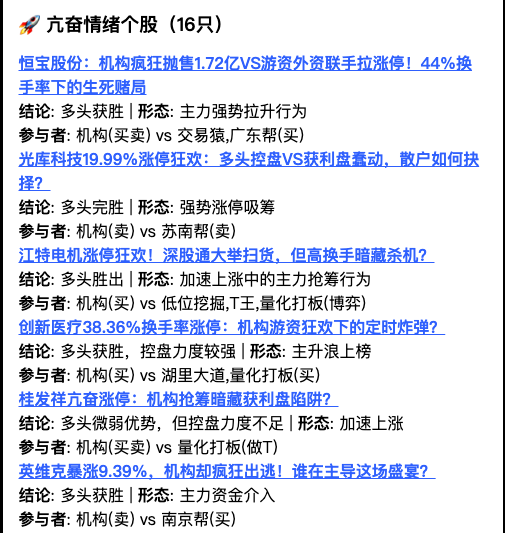

### **Gushen AI 产品发布公告**

**标题：穿透席位，洞见博弈——Gushen AI 推出“龙虎榜AI席位博弈解读”功能**

今天，我们正式推出 Gushen AI 的“龙虎榜AI席位博弈解读”功能。

它旨在解决投资者在解读龙虎榜数据时面临的信息过载与分析深度不足的核心痛点，将复杂的席位数据转化为清晰、专业、可执行的博弈洞察。

一份龙虎榜榜单的价值远不止于买卖金额的简单罗列。真正的洞察力来源于对榜单背后多空力量、关键角色及其意图的深度剖析。

为此，我们的“龙虎榜资金博弈分析系统”构建了四大核心能力：

**1. 多维分析框架**
*   **能力阐述**：我们摒弃了单一维度的解读方式，构建了一个由AI驱动的七模块智能分析矩阵。系统将自动对每份榜单进行「上榜原因」、「战局概览」、「核心力量识别」、「买卖双方结构」、「历史K线」、「多空博弈强度」，直至后市策略与风险展望的全方位、系统性推理。
*   这意味着，您无需再耗费数小时搜集资料、拼凑逻辑，系统能在3分钟内为您呈现一份媲美专业机构研究报告的深度分析。它将清晰揭示战局的关键点、主力资金的真实意图以及潜在的剧本走向。

**2. 多空力量可视化**
*   **能力阐述**：基于Gushen AI的专业设计语言，我们将枯燥的席位数据渲染成一张动态交互的“多空博弈图”。红色代表买方力量，绿色代表卖方压力，资金规模一目了然。
*   直观洞察买卖双方的资金对比、席位的具体类型（如机构专用、知名游资、普通营业部），并快速定位锁仓与砸盘的核心力量。我们让数据自己开口说话。

**3. 顶级游资动态追踪**
*   **能力阐述**：系统内置并实时更新“游资名人录”数据库。当榜单中出现如“炒股养家”、“章盟主”等知名游资席位时，系统不仅能即时识别，更会结合其历史操作成功率、持股周期与风格偏好，进行高亮标注与自动化解读。
*   当您看到市场“聪明钱”的身影时，不再是单纯的兴奋或困惑。系统会为您解读其此次操作可能代表的信号——是“一点火”还是“一日游”？这有助于您更深刻地理解市场顶级玩家的行为逻辑。

**4. 动态交互式AI评论区**
*   **能力阐述**：每篇报告下方都附有一个独特的动态AI评论区。它由两部分构成：首先，系统会自动模拟“多头”与“空头”的观点交锋，提前为您预演市场的潜在分歧，为您进行沙盘推演。其次，系统会预设大家最关心的问题并生成回答。
*   您可以随时发表自己的见解，或提出新的问题。更妙的是，当您在评论区使用“@”功能向我们的AI提问时，将触发深度解答。这让每一篇报告都从静态分析，变成了一个能与您实时互动的私人投研助理。

**5. 每日龙虎榜分析汇总**
*   **能力阐述**：除了对单只个股的深度解剖，Gushen AI独有的“龙虎榜每日汇总”功能，能让您从全局视角洞察市场。这份“上帝视角”战报，不仅提供整体的**情绪分布**和**风险评估**，更核心的是，它将所有上榜个股的**关键K线形态**（如“趋势加速”、“高位出货”）与**核心参与者**（是“机构”主导还是“赵老哥”等知名游资在博弈）进行了智能汇总和清晰罗列。您只需一分钟，就能迅速锁定处于“趋势加速”形态且有“顶级游资”介入的潜力股，真正做到高效复盘，精准出击。

#### **实战场景演示**

以近期市场关注的稳定币龙头恒宝股份（8月12日上榜）为例：

**传统解读**：投资者看到龙虎榜数据，买卖金额巨大，席位众多，感到杂乱无章，难以判断是机会还是陷阱。

**Gushen AI分析流程**:

1.  **关键指标速览**：题目下方当日的核心交易数据——换手率高达44.10%，成交额55.56亿元。这些关键指标为深度分析提供了坚实的数据背景，让用户对个股的整体活跃度一目了然。
2.  **全局可视化**：“多空博弈图”清晰显示，龙虎榜净额2.67亿元，红色买方力量显著占优。买一席位“深股通专用”尤其突出，成为全图焦点。
3.  **核心角色识别**：系统不仅识别出各路资金，更贴心地通过`[机]`（机构）、`[游]`（游资）等标签对席位进行了分类高亮。如图所示，买方阵营中，既有代表外资的“深股通专用”席位，也有“交易猿”、“广东帮”等`[游]`知名游资；而卖方前三席均为`[机]`机构专用。这种可视化的分类，让机构、外资、游资三方势力的激烈博弈格局一目了然。

### **二、 深度分析：洞察主力意图**

**⚔️ 多空席位博弈表**  
| 席位/风格                | 操作方向 | 金额(亿) | 意图解析                  | 后手预判               |  
|--------------------------|----------|----------|---------------------------|------------------------|  
| **深股通专用** (外资通道) | 净买0.97 | 买3.16   | 中长期布局，无视短期波动   | 锁仓托底，温和加码     |  
| **交易猿** (华泰天津)     | 净买0.69 | 买0.75   | 暴力半路板，主升浪加速器   | 明日不封板即核按钮     |  
| **广东帮** (财通温岭)     | 净买0.59 | 买0.78   | 波浪式拉升，做T控节奏      | 3日内二次点火或分批撤 |  
| **机构专用** (三家合计)   | 净卖1.16 | 卖1.72   | 风险规避，调仓止盈         | 若买方弱化则持续抛压   |  

最终，我们的“顶级操盘手”Agent将所有信息汇总，生成一份直指核心的复盘笔记：
    *   **战局总览**：AI精准概括今日战局为“**亢奋情绪主导的多头碾压**”。报告点明，多头核心是“深股通”（外资）携手“交易猿”、“广东帮”两大游资，合力强封涨停；而空头主力则是三家“机构专用”席位，选择趁机大举抛售。
    *   **核心矛盾剖析**：系统进一步揭示了表象之下的核心矛盾——“**机构叛逃 vs. 游资封板，谁在预判谁的预判？**” AI一针见血地指出，这是一场典型的操作周期错配：游资豪赌次日的情绪溢价，而机构则在警惕估值过热的风险，双方的激烈对抗跃然纸上。
    *   **关键风险预警**：与普通分析不同，Gushen AI高亮了“**44.1%的死亡换手率**”这一致命隐患。报告解读，如此高的换手意味着当日入场资金的成本高度集中，筹码结构极其不稳定，一旦多头力竭，极易引发踩踏。
    *   **后市推演**：基于此，AI给出了清晰的后市观察点：次日买方力量能否有效承接机构的持续抛压，是决定短期走向的关键。它将复杂的博弈，提炼为对后续核心量价信号的直接判断，将主动权真正交还给用户。

通过这一流程，一个复杂的局面被清晰地解构为一幅包含关键角色、核心逻辑和未来可能性的战略笔记。

#### **技术理念：AI Agent协同分析框架**

为了实现以上分析深度，我们设计了一套AI Agent协同分析框架。其中，“数据处理Agent”负责清洗数据并识别游资身份；“多维分析Agent”从七个不同视角独立思考、交叉验证，形成初步判断；最终，我们引入了最关键的“顶级操盘手”。该Agent的人设是一位「在A股市场沉浮多年、已形成稳定交易体系的顶级操盘手」，他负责将所有冰冷的分析结论，转化为一篇语言犀利、直达本质、看穿主力意图的专业复盘笔记。正是他，为每一份报告注入了灵魂，确保了分析结果的深度、可读性与最终的实战价值。

#### **后续步骤与展望**

即刻起，每日收盘后大概18:00后，您可以在Gushen AI App的“龙虎榜”板块，查阅当天所有上榜个股的《龙虎榜席位解读》及可视化图表。

未来，我们计划将此拓展到更多Agent，当前的AI Agent协同分析框架仅仅是一个开始，我们将进一步扩展该框架，引入包括技术形态分析Agent、全市场资金流分析Agent、以及舆情分析Agent在内的专家角色，构建一个覆盖更广、决策维度更丰富的AI投研体系。Gushen AI将持续致力于将最前沿的AI技术，转化为能真正帮助投资者提升决策质量的可靠工具，赋能每一位投资者，在纷繁的市场中保持专业与冷静。

请直接访问 Gushen.cn 或点击文末「阅读原文」体验。

---

**写在最后**

市场无法预测，只能应对，任何工具都无法完全预测市场的未来。Gushen AI的“龙虎榜AI席位博弈解读”功能是一款基于公开数据和Deepseek等AI模型的决策辅助工具，其分析结论仅作为您理解市场博弈的维度之一，不构成任何投资建议。

市场有风险，投资需谨慎。我们希望Gushen AI能成为您在投资路上的得力助手，帮助您看得更清、想得更深。但最终的决策权永远在您手中，请务必结合自身的投资体系和风险偏好，做出独立的判断。

愿您能在投资这场充满挑战与机遇的无限游戏中，保持理性，持续进化，行稳致远，祝投资顺利。 