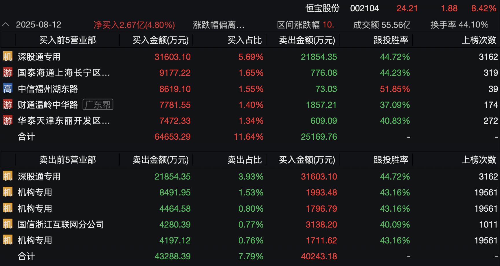
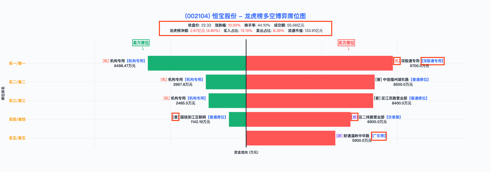

<div align="center">

# 🐉 Gushen AI - 龙虎榜智能分析系统

**让AI穿透龙虎榜，洞察资金博弈的真相**

[](https://www.python.org/)
[](https://www.deepseek.com/)
[](LICENSE)

*智能是最大的杠杆，上下文是起点，分析报告是终点*

</div>

---

## ✨ 项目亮点

> **"展示分析，而不是展示数据"** —— 这是我们设计这个系统的原点

市面上已经有很多龙虎榜工具了。但看完那些整齐排列的数据后，你真正想知道的是什么？

- 是 "中信证券北京总部买入2000万" 这个**事实**？
- 还是 "为什么中信会在这个位置买入，这意味着什么" 这个**分析**？

**Gushen AI 选择后者。** 我们用大语言模型作为产品的"大脑"和"灵魂"，让AI像一位顶尖操盘手那样去**思考**、去**洞察**、去**推演**。

### 🎯 三大设计哲学

| 原则 | 理念 |
|------|------|
| **智能是最大的杠杆** | 能上LLM就上LLM，让AI做主角而非工具 |
| **死磕上下文质量** | 80%的分析深度，在数据预处理阶段就已决定 |
| **交付分析而非对话** | 一份立场鲜明的报告，比无限可能的对话框更有价值 |

---

## 🖼️ 成果展示

### 📊 龙虎榜席位可视化

<div align="center">


</div>

*多空博弈一目了然：红色买入、绿色卖出，游资/机构/量化标签清晰标注*

### 📝 AI生成的分析帖子示例

```markdown
### 华盛锂电（688353.SH）盘后复盘笔记

#### 一、战局总揽：亢奋下的暗流涌动
今日华盛锂电以15%涨幅强势上榜...买方动力喷薄而出，市场情绪直达亢奋。
换手率21.64%叠加15.36%涨幅，赤裸裸暴露了散户跟风的狂热，
但主力资金净买入仅880.85万元（占流通市值0.35%），透出诡异信号...

**核心结论**：多方表面胜利（信心0.85），实则暗藏回吐杀机
——这是典型的情绪与逻辑背离时刻。
```

### 📈 每日市场情绪汇总

| 情绪 | 数量 | 占比 |
|------|------|------|
| 🚀 亢奋 | 40只 | 58.8% |
| 😰 恐慌 | 17只 | 25.0% |
| 🤔 分歧 | 11只 | 16.2% |

*自动识别知名游资（赵老哥、炒股养家、佛山系...）参与情况，洞察主力动向*

---

## 🔥 核心功能

```
┌─────────────────┐    ┌─────────────────┐    ┌─────────────────┐
│   数据获取层     │ -> │   AI分析引擎    │ -> │   内容生成层     │
│  Tushare API    │    │  DeepSeek LLM   │    │  帖子+可视化     │
└─────────────────┘    └─────────────────┘    └─────────────────┘
        │                      │                      │
   • 龙虎榜数据           • 5模块深度分析         • 故事化复盘笔记
   • 游资名人录           • 资金博弈推演          • 三角色评论区
   • 历史K线              • 后市策略展望          • 交互式图表
```

---

## 🚀 快速开始

```bash
# 1. 克隆项目
git clone https://github.com/your-repo/dragon-tiger.git

# 2. 安装依赖
pip install -r requirements.txt

# 3. 配置API密钥
cp .env.example .env
# 编辑 .env 文件，填入 DEEPSEEK_API_KEY 和 TUSHARE_TOKEN

# 4. 运行完整流水线
python dragon_tiger_pipeline.py --date 20250702 --enable-post
```

---

# 龙虎榜AI分析系统 - 项目对接指导文档

## 📋 最近更新 (2025-07-30)

### 📚 **技术文档完善**
- 📖 **分类逻辑详解文档** (`docs/Summary_post_龙虎榜分类逻辑与字段详解.md`)
  - 🔍 **核心分类体系**：详细阐述三元情绪分类（亢奋/恐慌/分歧）和参与者识别逻辑
  - 📊 **字段映射总表**：完整的JSON数据路径与系统内部字段对应关系
  - 🏗️ **数据流处理**：从文件扫描到统计汇总的完整技术实现
  - 🎯 **算法解析**：参与者摘要生成、情绪判断、风险评估等核心算法详解


📋 最近更新 (2025-07-28)
### 🚀 核心功能优化
1. **成品帖子范例集** (`成品帖子范例/`)
   - 📝 **精品案例展示**：收集整理高质量分析帖子和可视化报告作为参考模板
   - 🎯 **内容标准化**：包含完整的个股分析帖子、龙虎榜可视化报告、每日汇总等典型输出样例
   - 💡 **开发参考**：为产品设计和内容生成提供标杆案例，便于快速理解输出标准

2. **帖子生成器重大升级** (`post_generator_v2(huoshan).py`)
   - ✨ **Prompt全面优化**：帖子主体内容生成prompt大幅改进，可视化程度显著提升
   - 🎯 **评论区功能完善**：三角色评论区固定了nickname，交互体验更加一致
   - 🔥 **火山引擎API优化**：专门配置温度参数（JSON生成0.5，帖子生成0.7）以平衡准确性与创造性

3. **分析引擎精准调优** (`funding_battle_analyzer.py`)
   - 📊 **K线模块优化**：模块六K线分析prompt精简，删除冗余示例，提升分析效率

4. **数据洞察新增** (`data/analyzed/market_sentiment_stats.py`) 
   - 📈 **每日汇总报告**：全新的龙虎榜每日分析汇总功能，提供市场情绪统计
   - 🎯 **风险评估**：按情绪级别（亢奋/恐慌/分歧）分类展示，便于快速识别市场机会
   - 💡 **智能洞察**：自动识别核心参与者（机构vs知名游资），提供更深层的市场理解

### 🔧 技术改进
- **温度参数精调**：针对不同任务类型优化AI生成参数，JSON格式输出更稳定，创意内容更丰富
- **火山引擎适配**：专门为火山引擎DeepSeek API进行接口优化和参数调优

---
## 项目概述

本项目是一个基于AI的龙虎榜数据分析系统，通过（DeepSeek API）对A股龙虎榜数据进行智能分析，生成专业的投资分析报告和可视化图表。

### 核心功能
1. **数据获取**：从Tushare API获取龙虎榜、个股席位、K线等数据
2. **数据处理**：清洗、格式化和整合多源数据，识别游资身份
3. **AI分析**：使用DeepSeek AI进行多维度资金博弈分析
4. **内容生成**：生成故事化的分析帖子，包含多角度评论
5. **数据可视化**：生成交互式的多空博弈席位图

## 一、核心代码模块详解

### 1. data_fetcher.py - 数据获取模块
**位置**: `core/data_fetcher.py`

**主要功能**：
- 从Tushare API获取龙虎榜相关数据
- 支持获取龙虎榜列表、个股席位、日K线、游资名人录等数据

**核心类和方法**：
```python
class DataFetcher:
    def __init__(self, tushare_token=None)  # 初始化，需要Tushare token
    def fetch_top_list(self, trade_date)    # 获取龙虎榜每日列表
    def fetch_top_data(self, trade_date)    # 获取个股席位数据
    def fetch_daily_data(self, ts_codes)    # 获取股票日K线数据
    def fetch_hm_list(self)                 # 获取游资名人录数据
```

**测试方式**：
```python
# 文件末尾有完整的测试用例 main()
# 测试数据会保存到: test_top_list.csv, test_top_data.csv等
python core/data_fetcher.py
```

### 2. data_processor.py - 数据处理模块
**位置**: `core/data_processor.py`

**主要功能**：
- 数据清洗和格式化（金额转换、百分比格式化等）
- 合并多源数据，处理重复记录
- 识别游资身份和风格画像
- 生成结构化的JSON数据

**核心类和方法**：
```python
class DataProcessor:
    def __init__(self, data_fetcher=None)
    def process_single_date_data(self, trade_date, days_back=10)  # 核心方法
    def _process_seat_data(self, ts_code, top_data_df, hm_list_df)  # 处理席位数据
    def _identify_player(self, seat_name, hm_list_df)  # 识别游资身份
    def save_processed_data(self, processed_data, file_path)  # 保存JSON
```

**数据格式规范**：
- 金额：万元/亿元，带单位
- 百分比：保留2位小数，带%号
- 成交量：万手为单位
- 日期：YYYY-MM-DD格式

**测试方式**：
```python
# 测试会生成: test_processed_data_0624.json
python core/data_processor.py
```

### 3. deepseek_interface.py - AI接口模块
**位置**: `core/deepseek_interface.py`

**主要功能**：
- 封装DeepSeek API调用
- 支持流式/非流式文本生成
- 支持获取推理过程（思考链）
- 支持生成结构化JSON输出

**核心类和方法**：
```python
class DeepSeekInterface:
    def __init__(self, api_key=None, model_version=None)
    def generate_text_with_thinking(self, prompt)  # 带思考过程的生成
    def generate_json_output(self, prompt, json_schema)  # JSON格式输出
    def stream_output_with_thinking(self, prompt, callback_thinking, callback_answer)  # 流式输出
```

**环境配置**：
```bash
# 需要在.env文件中配置
DEEPSEEK_API_KEY=your_api_key_here
DEEPSEEK_MODEL_VERSION=deepseek-reasoner  # 可选，默认使用deepseek-reasoner
```

### 4. funding_battle_analyzer.py - 资金博弈分析模块
**位置**: `core/funding_battle_analyzer.py`

**主要功能**：
- 实现5模块分析流水线（优化合并版）
- 每个模块调用DeepSeek API进行专业分析
- 生成完整的分析报告JSON

**分析模块**：
1. **模块1+2合并**：上榜原因解读 + 战局总览
2. **模块3**：核心力量分析（识别关键玩家）
3. **模块4+5合并**：买方结构 + 卖方压力分析
4. **模块6**：历史趋势与行为定性
5. **模块7**：后市策略与风险展望

**使用方式**：
```python
analyzer = FundingBattleAnalyzer()
result = analyzer.analyze_complete_report(
    data_file_path="core/test-seat.json",
    output_path="analysis_report.json"
)
```

**命令行使用**：
```bash
python core/funding_battle_analyzer.py core/test-seat.json -o output.json
```

### 5. post_generator_v2.py - 帖子生成器
**位置**: `core/post_generator_v2.py`

**主要功能**：
- 两阶段生成流程
- 阶段一：生成故事化的复盘笔记
- 阶段二：生成三角色评论区（多头、空头、新手）
- 保存为Markdown格式

**核心类和方法**：
```python
class PostGeneratorV2:
    def generate_post(self, json_file_path, save_thinking=True)  # 完整流程
    def generate_stage1_content(self, analysis_data)  # 生成主干内容
    def generate_stage2_content(self, analysis_data, stage1_content)  # 生成评论区
```

**输出文件格式**：
```
{trade_date}_{stock_name}_gushen_post_v2.1_{timestamp}.md
```

### 6. seat_visualization.py - 可视化模块
**位置**: `core/seat_visualization.py`

**主要功能**：
- 使用Plotly生成交互式图表
- 展示买卖双方席位资金对比
- 标注游资、机构等不同类型席位
- 生成精美的HTML报告

**核心类和方法**：
```python
class SeatVisualization:
    def create_seat_battle_chart(self, stock_data)  # 创建多空博弈图
    def generate_report(self, json_file, output_html)  # 生成完整报告
```

**设计特点**：
- 采用GushenAI设计语言
- 红色表示买方（中国股市传统）
- 绿色表示卖方
- 包含完整的关键指标展示

### 7. stock_data_extractor.py - 数据提取工具
**位置**: `utils/stock_data_extractor.py`

**主要功能**：
- 从完整的龙虎榜数据中提取指定个股数据
- 支持按股票名称或代码搜索
- 交互式提取界面
- 保存提取的个股数据供测试使用

**核心类和方法**：
```python
class StockDataExtractor:
    def __init__(self, data_file_path)  # 初始化，加载数据文件
    def list_all_stocks()  # 列出所有股票
    def search_stock(query)  # 搜索股票（支持模糊匹配）
    def extract_stock_by_name(stock_name)  # 按名称提取
    def extract_stock_by_code(ts_code)  # 按代码提取
    def save_stock_data(stock_data, output_dir)  # 保存数据
    def interactive_extract()  # 交互式提取界面
```

**使用方式**：
```bash
# 命令行使用
python utils/stock_data_extractor.py data/processed/20250702_processed_data.json -s "红太阳"

# 交互式模式
python utils/stock_data_extractor.py data/processed/20250702_processed_data.json -i

# 列出所有股票
python utils/stock_data_extractor.py data/processed/20250702_processed_data.json -l
```

### 8. market_sentiment_stats.py - 每日汇总报告生成器 🆕
**位置**: `data/analyzed/market_sentiment_stats.py`

**主要功能**：
- 📅 按日期分组统计个股情绪水平分布（亢奋/恐慌/分歧）
- 📊 生成美观的控制台报告展示和Markdown文件输出
- 👥 识别核心参与者（机构vs知名游资动向）
- 📈 K线形态分析统计（高位出货、低位吸筹等技术形态）
- 🎯 提供个股情绪洞察和风险评估

**核心功能**：
```python
def scan_market_sentiment_levels()  # 扫描所有分析文件，按日期统计
def analyze_core_players(buying_force, selling_force)  # 分析核心参与者
def display_statistics(daily_stats, total_stocks, error_files)  # 控制台展示
def save_to_file(daily_stats, total_stocks)  # 保存Markdown报告
```

**输出特点**：
- **情绪分布统计**：按亢奋/恐慌/分歧三个维度分类展示
- **核心玩家识别**：自动识别知名游资（如方新侠、赵老哥等）参与情况
- **风险等级评估**：基于情绪分布自动评估整体市场风险
- **Markdown报告**：生成格式化的每日汇总报告文件

**使用方式**：
```bash
# 生成当日汇总报告
python data/analyzed/market_sentiment_stats.py

# 输出文件示例
# lhb_daily_analysis_summary_20250728_102157.md
```

## 二、主要脚本和工具

### 1. dragon_tiger_pipeline.py - 完整流水线
**位置**: 项目根目录

**主要功能**：
- 串联所有模块的完整工作流
- 支持高并发批量处理
- 自动生成分析报告和帖子
- 进度跟踪和错误处理

**核心类**：
```python
class DragonTigerPipeline:
    def __init__(self, tushare_token=None, max_workers=16, enable_post_generation=False)
    def process_date(self, trade_date)  # 处理指定日期的所有数据
    def batch_analyze_stocks(self, stock_data_files)  # 批量分析
```

**使用示例**：
```bash
# 处理指定日期
python dragon_tiger_pipeline.py --date 20250702 --enable-post

# 批量分析已有数据
python dragon_tiger_pipeline.py --batch data/extracted/*.json
```


## 三、测试数据说明

### JSON测试文件（core目录）
- `core/test-seat.json` - 标准龙虎榜数据格式示例
- `core/test-seat-2.json` - 测试数据变体2
- `core/test-seat-3.json` - 测试数据变体3
- `core/test-seat-4.json` - 测试数据变体4
- `core/test_processed_data_0624.json` - 处理后的完整数据示例
- `core/test_funding_summary.json` - 资金分析摘要示例
- `core/test_funding_summary_llm.json` - LLM分析结果示例

### CSV测试文件（core目录）
- `core/test_top_list.csv` - 龙虎榜列表数据
- `core/test_top_data.csv` - 个股席位数据
- `core/test_hm_list.csv` - 游资名人录数据

### 数据格式示例
```json
{
  "stocks": [{
    "ts_code": "000525.SZ",
    "name": "红太阳",
    "trade_date": "20250617",
    "basic_info": {
      "close": 9.03,
      "pct_change": "9.99%",
      "turnover_rate": "16.46%",
      "amount": "14.59亿元",
      "net_amount": "1.28亿元"
    },
    "seat_data": {
      "buy_seats": [...],
      "sell_seats": [...]
    },
    "historical_data": {...}
  }]
}
```

## 四、data目录结构说明

### 目录层级
```
data/
├── raw/                    # 原始数据（从Tushare获取）
│   ├── top_list.csv       # 龙虎榜列表
│   ├── top_data.csv       # 个股席位数据
│   ├── hm_list.csv        # 游资名人录
│   └── daily_data.csv     # K线数据
├── processed/             # 处理后的结构化数据
│   ├── 20250702_processed_data.json    # 某日完整数据
│   └── test_*.json        # 测试数据文件
├── extracted/             # 提取的单个股票数据
│   └── {date}_{time}_{stock}_extracted.json
├── analyzed/              # AI分析结果
│   └── 20250702/         # 按日期组织
│       ├── *_analysis.json  # 个股分析报告
│       └── summary.json     # 当日汇总统计
└── output/                # 最终输出
    ├── posts/            # 生成的帖子
    │   └── 20250702/     # 按日期组织
    └── summaries/        # 汇总报告

```

### 数据流转过程
1. **raw/** - 原始CSV数据，由data_fetcher获取
2. **processed/** - 经data_processor处理的JSON格式数据
3. **extracted/** - 使用stock_data_extractor提取的单只股票数据
4. **analyzed/** - funding_battle_analyzer生成的分析报告
5. **output/posts/** - post_generator_v2生成的最终帖子

### 重要数据文件说明

#### processed目录
- **{date}_processed_data.json** - 某日所有龙虎榜股票的完整数据，包含基本信息、席位数据、历史K线等
- **test_*.json** - 用于开发测试的样本数据

#### analyzed目录  
- **{stock_name}_{ts_code}_analysis.json** - 单只股票的AI分析报告，包含7个模块的分析结果
- **summary.json** - 当日所有股票的统计汇总，包含资金流向、玩家活跃度等

#### output/posts目录
- **{date}_{stock_name}_gushen_post_v2.1_{time}.md** - 最终生成的分析帖子，包含主文和评论区

## 五、完整运行流程

### 1. 环境准备
```bash
# 安装依赖
pip install -r requirements.txt

# 配置环境变量
cp .env.example .env
# 编辑.env文件，填入API密钥
```

### 2. 数据获取和处理
```python
# 步骤1：获取原始数据
from core.data_fetcher import DataFetcher
fetcher = DataFetcher()
top_list = fetcher.fetch_top_list('20250617')

# 步骤2：处理数据
from core.data_processor import DataProcessor
processor = DataProcessor(fetcher)
processed_data = processor.process_single_date_data('20250617')
processor.save_processed_data(processed_data, 'processed_data.json')
```

### 3. AI分析
```python
# 步骤3：运行资金博弈分析
from core.funding_battle_analyzer import FundingBattleAnalyzer
analyzer = FundingBattleAnalyzer()
report = analyzer.analyze_complete_report('processed_data.json', 'analysis_report.json')
```

### 4. 内容生成
```python
# 步骤4：生成分析帖子
from core.post_generator_v2 import PostGeneratorV2
generator = PostGeneratorV2()
result = generator.generate_post('analysis_report.json')
```

### 5. 可视化
```python
# 步骤5：生成可视化图表
from core.seat_visualization import SeatVisualization
visualizer = SeatVisualization()
visualizer.generate_report('processed_data.json', 'visualization.html')
```

## 四、注意事项

### 1. API配置
- Tushare Token：需要注册Tushare账号获取
- DeepSeek API Key：需要注册DeepSeek账号获取（支持官方API和火山引擎API）
- 建议将密钥保存在.env文件中，不要硬编码

### 2. 数据质量
- data_processor会自动处理数据格式和单位
- 会自动识别并过滤可转债数据
- 席位数据会自动去重和整合

### 3. AI调用优化 🆕
- funding_battle_analyzer采用合并模块设计，减少API调用次数
- 每次完整分析需要5次API调用
- **温度参数优化**：
  - JSON格式输出：temperature=0.5（确保结构化输出稳定性）
  - 创意内容生成：temperature=0.7（平衡创造性与准确性）
- **火山引擎API支持**：专门适配火山引擎DeepSeek接口，提供更稳定的服务
- 建议控制调用频率，避免超限

### 4. 错误处理
- 每个模块都有完善的日志记录
- API调用失败会有明确的错误提示
- 数据验证失败会记录警告信息

## 六、其他重要文件说明

### 根目录测试脚本

1. **test_funding_analyzer.py**
   - 测试funding_battle_analyzer模块
   - 验证AI分析功能是否正常

2. **extract_stock_demo.py**
   - 股票数据提取的演示脚本
   - 展示如何使用StockDataExtractor

3. **Youzi_fetcher.py** （该文件仅做测试，不在生产流水线中，不需要关注）
   - 游资数据爬取工具
   - 补充获取游资相关信息

### 配置文件

1. **.env.example**
   - 环境变量配置模板
   - 包含API密钥等敏感信息的配置示例

2. **requirements.txt**
   - Python依赖包列表
   - 包含所有必需的第三方库

## 七、开发建议

1. **扩展数据源**：可以考虑接入更多数据源，如东方财富、同花顺等
2. **优化AI提示词**：根据实际效果调整各模块的prompt（已针对可视化和评论区进行优化 ✅）
3. **增加缓存机制**：对于频繁请求的数据可以加入缓存
4. **批量处理**：可以扩展支持批量处理多只股票
5. **定时任务**：可以设置定时任务自动生成每日报告
6. **性能优化**：dragon_tiger_pipeline已支持高并发，可根据API限制调整max_workers
7. **监控告警**：增加数据异常和分析失败的监控机制
8. **市场情绪追踪 🆕**：利用新增的market_sentiment_stats功能，建立情绪指标追踪体系
9. **温度参数调优 🆕**：根据不同任务类型继续优化AI生成参数，提升内容质量

## 八、常见问题

1. **Q: API调用失败怎么办？**
   A: 检查API密钥是否正确，网络是否正常，API额度是否充足

2. **Q: 数据获取为空？**
   A: 检查日期是否为交易日，股票代码是否正确

3. **Q: 生成的图表显示异常？**
   A: 确保安装了plotly库，检查数据格式是否正确

4. **Q: AI分析结果不理想？**
   A: 可以调整temperature参数，或优化prompt内容

5. **Q: 如何快速测试单个模块？**
   A: 每个核心模块都有main()函数，可以直接运行测试

6. **Q: 批量处理时内存占用过大？**
   A: 可以减少max_workers数量，或分批处理数据

## 九、快速上手指南

### 最简单的测试流程

```bash
# 1. 设置环境变量
export DEEPSEEK_API_KEY="your_key"
export TUSHARE_TOKEN="your_token"

# 2. 测试数据处理
python core/data_processor.py

# 3. 测试AI分析（使用测试数据）
python core/funding_battle_analyzer.py core/test-seat.json

# 4. 生成可视化
python core/seat_visualization.py

# 5. 运行完整流水线
python dragon_tiger_pipeline.py --date 20250702
```

### 开发调试建议

1. 先使用test-*.json测试文件验证功能
2. 使用交互式工具（如stock_data_extractor）熟悉数据结构
3. 查看data/analyzed/目录下的分析结果了解AI输出格式
4. 参考data/output/posts/目录下的帖子示例

## 联系方式

如有任何问题，请联系项目负责人或查看项目文档。

---
文档版本：V2.1
更新日期：2025-01-XX
更新内容：
- 🚀 新增帖子生成器重大升级说明（post_generator_v2(huoshan).py）
- 📊 新增每日汇总报告生成器功能说明（market_sentiment_stats.py）
- ⚡ 更新K线分析模块优化信息（funding_battle_analyzer.py）
- 🔧 新增火山引擎API和温度参数配置说明
- 💡 补充新功能使用建议和开发指南

历史版本：
V2.0 (2025-07-09)：
- 新增stock_data_extractor.py工具说明
- 补充根目录测试脚本说明
- 详细说明data目录结构
- 增加快速上手指南