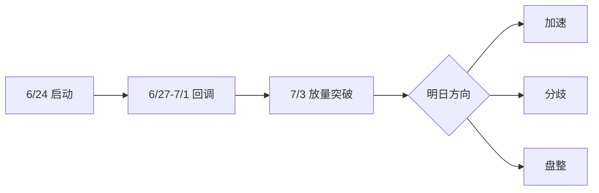

<!-- 温度设置: 0.7 | 运行次数: 1 -->

### 华盛锂电（688353.SH）盘后复盘笔记  
**日期：2025年7月3日**  

---

#### **一、战局总揽：亢奋下的暗流涌动**  
今日华盛锂电以15%涨幅强势上榜，核心原因如数据所示：  
> "有价格涨跌幅限制的日收盘价格涨幅达到15%的前五只证券"  
这绝非偶然——**买方动力喷薄而出，市场情绪直达亢奋**。换手率21.64%叠加15.36%涨幅，赤裸裸暴露了散户跟风的狂热，但主力资金净买入仅880.85万元（占流通市值0.35%），透出诡异信号：多方看似碾压，实则控盘力度中等，空方如潜伏的毒蛇。数据背后的人性博弈昭然若揭：亢奋共识下，获利盘正磨刀霍霍。  
**核心结论**：多方表面胜利（信心0.85），实则暗藏回吐杀机——这是典型的情绪与逻辑背离时刻。  

---

#### **二、锁定关键玩家：游资与机构的合谋**  
今日龙虎榜是资金派系的角斗场。买方散而不乱，卖方隐忍待发。**深扒玩家底牌**：  

| 席位名称                                  | 玩家类型       | 成交额（净额） | 行为类型       | 风格画像                                                                 | 动机与后续动作                               |  
|-------------------------------------------|----------------|----------------|----------------|--------------------------------------------------------------------------|----------------------------------------------|  
| 中信证券上海溧阳路证券营业部              | 知名游资       | 买入0.22亿元   | 主封接力       | **隔夜核按钮专业户**：超短战法，历史反复做T或快速砸盘，今日封板只为隔夜溢价。 | 明早高开即砸盘，锁定利润。                   |  
| 机构专用                                  | 机构           | 买入0.22亿元   | 建仓加仓       | **格局锁仓派**：中长线持有，基本面驱动，无视短期波动。                     | 锁仓数月，除非基本面恶化。                   |  
| 机构专用                                  | 机构           | 买入931.55万元 | 建仓加仓       | 同上，但仓位较轻。                                                       | 逢低补仓，趋势不破不离场。                   |  
| 国盛证券宁波桑田路证券营业部              | 知名游资       | 买入913.84万元 | 打板买入       | **点火引导高手**：打板战法，跑得飞快，今日入场即博次日溢价。               | 明日若滞涨，秒撤；加速则做T。                |  
| 国泰海通证券总部                          | 量化基金       | 卖出0.10亿元   | 做T卖出        | **做T机器**：算法驱动高抛低吸，今日抛售仅为调仓。                         | 明日继续高频做T，制造盘中波动。              |  

**玩家博弈图谱**：  
- **协同性**：溧阳路与桑田路形成游资同盟，利用亢奋情绪点火封板——本质是"搭机构便车"。机构锁仓提供稳定性，游资借机套利。  
- **对立性**：量化基金（国泰海通）冷眼旁观，今日抛售是精准收割跟风盘，后续将用算法放大波动。  
- **非共识洞察**：市场只看到游资狂欢，我却嗅到量化陷阱——它们今日卖出占比仅2.06%，却埋下高波动引信。  

**关键推演**：  
- 溧阳路明早必砸盘，若机构不托盘，股价将闪崩。  
- 桑田路是墙头草，加速则留，分歧则逃。  
- 量化基金非敌人，而是"波动放大器"，善用其T+0特性可反套利。  

---

#### **三、趋势与意图印证：加速中的裂痕**  
短期趋势图如利剑出鞘：  

- **趋势定位**：主升浪加速段，7月3日大阳线（实体5.42元）突破前高37.79元，量能暴增43.94%，表面健康。  
- **量价拆解**：但细看买盘——游资占比超6%，机构占6.37%，量化卖盘潜伏。**与玩家意图交叉验证**：游资的隔夜属性与趋势加速矛盾，一旦高开低走，量能即刻反噬。  
- **最终定调**：加速预期（机构锁仓支撑）与分歧风险（游资获利盘+量化抛压）并存，非共识在于——市场误读"放量"为强势，实则是出货温床。  

---

#### **四、提炼核心矛盾**  
> 多空博弈的本质是：**锁仓机构与隔夜游资的短暂同盟，能否扛住量化镰刀与散户获利盘的集体反扑？**  
- **博弈双方**：多方（溧阳路+桑田路+机构） vs 空方（量化基金+潜伏获利盘）。  
- **矛盾焦点**：机构的中长线逻辑 vs 游资的闪电战天性——同盟随时崩解。  

---

#### **五、明日应对预案  
总体策略：高抛低吸，利用波动套利，绝不追高。**  

- **情景推演**：  
  - [ ] **上行情况（概率30%）**：若机构托盘+游资暂缓砸盘，股价冲高至42元上方。**行动**：减仓游资主导部分（如溧阳路关联仓位），保留机构筹码。  
  - [ ] **下行情况（概率50%）**：溧阳路砸盘引发踩踏，回踩37.79元支撑。**行动**：在37.5元附近吸筹，博机构护盘；破位36.8元则清仓。  
  - [ ] **盘整情况（概率20%）**：量化基金做T，股价震荡于38-40元。**行动**：网格交易，38元买、40元卖，吃波动红利。  

**风控底线**：单日回撤超5%即止损，仓位≤30%。  

---

**操盘体感**：今日盘面如盛夏雷雨——炽热中藏闷雷。散户的亢奋是游资的饵料，机构的沉默是暴风前的宁静。记住：非共识机会总在情绪裂痕中滋生，明日盯紧溧阳路的砸盘信号，那将是猎场开门的枪声。  

---  
*复盘人：顶级操盘手*  
*2025年7月3日夜*

---

# 华盛锂电暴涨15%：游资狂欢背后暗藏风险？

## 💬 评论区热议

### 🔥 多头观点
**@格局哥**: 太燃了！华盛锂电一天暴涨15%，机构游资齐上阵！上海溧阳路主封，机构加仓，量价配合完美！突破新高，主升浪启动！多头合力无敌，拿着别怂！

### ⚠️ 空头提醒
**@利好兑现就跑路**: 冷静分析：大涨15%后获利了结压力巨大。量化基金已出货，卖压高企，亢奋情绪易反转。风险包括机构潜在获利回吐和市场情绪冷却。纪律优先，避免追高。

### ❓ 新手求教
**@明天能回本吗**: 股价大涨但风险也大，作为新手，如何识别是真突破还是陷阱？

**回复**: 核心观点：趋势可能延续，但需警惕回调。逻辑上，量价健康（成交量增43.94%，涨幅15.36%），游资协同买入显示短期动能；但风险点：获利盘集中（卖压高）和量化基金卖出易引发波动。新手应关注关键支撑位（如6月26日高点37.79），设置止损，仓位分散。若跌破支撑，及时退出。

---
*本评论区为AI模拟生成，仅供参考，投资需谨慎*
