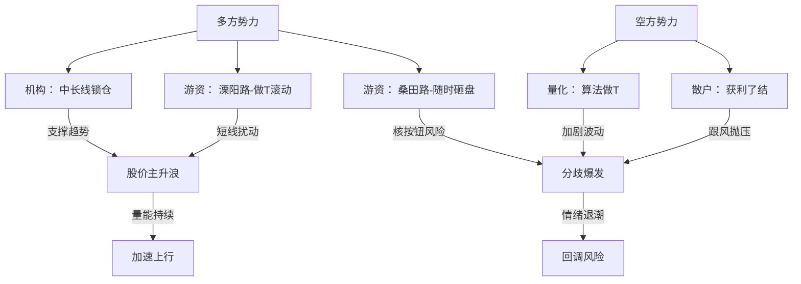

<!-- 温度设置: 0.8 | 运行次数: 2 -->

### 华盛锂电（688353.SH）20250703盘后复盘笔记  
> **今日盘感：** 亢奋情绪下，多方强势推升股价，但盘口暗流涌动——机构入场锁仓的“长逻辑”与游资快进快出的“短博弈”交织，一场获利盘与主升浪的角力悄然上演。冷静观察，数据背后是人性的贪婪与恐惧的拉锯。  

---

#### **一、战局总揽**  
> 上榜原因："有价格涨跌幅限制的日收盘价格涨幅达到15%的前五只证券"。这绝非偶然——单日暴涨15.36%，换手率21.64%，量能放大43.94%，赤裸裸暴露了市场情绪的狂热。买方主导明显，主力资金净买入880.85万元，但仅占流通市值0.35%，控盘力度中等，多空对抗虽未白热化，却暗藏裂痕。亢奋中，获利盘已悄然堆积，非共识机会在于：**情绪高潮能否扛住筹码松动？**  

**核心结论：** 多方以机构+游资合力推高股价，形成突破性大阳线，但卖方量化及散户获利了结施压，博弈本质是"长线布局 vs 短线套利"的碰撞。短期趋势加速，但分歧风险正在发酵。  

---

#### **二、关键玩家剖析**  
今日龙虎榜是资金博弈的微缩战场。买方分散却协同，卖方施压却无序。深扒席位，洞见人性：  

| 席位名称 | 玩家类型 | 成交额（买入/卖出） | 净额 | 占榜比 | 今日行为 | 操盘风格 | 动机与后续动作 |
|----------|----------|---------------------|------|--------|----------|----------|----------------|
| 中信证券上海溧阳路 | 知名游资 | 买入0.22亿 / 卖出0 | +0.22亿 | 买占4.53% | 主封龙头股 | 超短隔夜战法：反复做T或快速获利了结 | 试水接力，明日大概率做T滚动，警惕盘中砸盘。 |
| 机构专用 | 机构 | 买入0.22亿 / 卖出0 | +0.22亿 | 买占4.48% | 建仓加仓 | 中长线锁仓：基本面选股，目标达成前不离场 | 看好锂电赛道，中长期持有，提供趋势支撑。 |
| 机构专用 | 机构 | 买入931.55万 / 卖出0 | +931.55万 | 买占1.89% | 建仓加仓 | 同上，中长线布局 | 协同首机构，分批入场，后续或持续流入。 |
| 宁波桑田路 | 知名游资 | 买入913.84万 / 卖出0 | +913.84万 | 买占1.85% | 打板买入 | 打板战法：跑得飞快，锁仓做T或隔夜离场 | 短炒套利，明日若高开可能核按钮出货。 |
| 国泰海通总部 | 量化基金 | 买入0 / 卖出0.10亿 | -1016.83万 | 卖占2.06% | 做T卖出 | 量化策略：频繁做T，算法驱动动态调整 | 套利止盈，后续或继续高抛低吸，加剧波动。 |

**深度解读：**  
- **协同与对立：**  
  - 买方游资（溧阳路+桑田路）形成松散同盟——溧阳路善点火引导，桑田路好打板跟风，两者同进推高情绪，但风格迥异：溧阳路可能反复做T维持热度，桑田路却随时反手砸盘。非共识在于：游资的"虚假团结"能否持续？  
  - 机构双席位净流入，传递长线信心，与游资短炒形成对冲。机构锁仓为趋势背书，但若游资撤退，可能孤军奋战。  
  - 卖方量化（国泰海通）冷血执行算法卖出，叠加散户获利了结（卖压均匀分布），暴露市场浮躁——涨势中已有筹码松动。  

- **玩家动机全景：**  
  - **溧阳路：** 试探性建仓，意图借情绪高潮做T套利。历史风格显示其"隔夜即走"，明日若量能萎缩，可能反手抛售。  
  - **机构：** 主升加仓，基于锂电基本面布局。中长线视角，提供"压舱石"作用，但需警惕若情绪退潮，可能被动减持。  
  - **桑田路：** 恐慌性打板入场，典型"追涨杀跌"。明日开盘若溢价不足，恐化身核按钮专业户。  
  - **量化：** 冷静止盈，今日做T卖出仅是开始。算法驱动下，后续或持续高抛低吸，制造"锯齿形"波动。  

**盘感映射：** 游资的"贪婪快感"与机构的"理性沉稳"碰撞，量化则如旁观者收割——市场在亢奋中分化，明日关键看溧阳路与桑田路的默契是否破裂。  

---

#### **三、趋势与意图印证**  
> 股价轨迹是资金意图的赤裸投影：  
- **短期趋势：** 主升浪明确——6月24日启动，7月3日放量突破前高（37.79元），大阳线实体5.42元，收盘39.8元。量价健康（量增43.94%配合价涨），印证买方主导。  
- **玩家意图交叉验证：**  
  - 机构建仓支撑"加速预期"：中长线资金入场，暗示趋势延续潜力。  
  - 但卖方量化+分散卖压暴露"分歧风险"——获利盘已蠢动，与游资短炒风格矛盾。若桑田路次日砸盘，可能触发连锁抛售。  
**修正判断：** 趋势虽强，但情绪过热，非共识机会在于"回调低吸"，而非追高。  

---

#### **四、提炼核心矛盾**  
> 一针见血：**这场博弈的本质是什么？**  
- **博弈双方：** 多方（机构长线锁仓 + 游资短炒点火） vs. 空方（量化算法止盈 + 散户获利了结）。  
- **矛盾焦点：** 机构的中长期产业逻辑能否压制游资的投机性撤退？亢奋情绪与筹码松动的拉锯，焦点在"量能能否持续放大"。  
> 发人深省：当溧阳路与桑田路共舞时，谁会在音乐停止前抽身离场？  

---

#### **五、明日应对预案**  
**总体策略：高抛低吸，严控仓位——情绪高潮后的分化期，忌追涨杀跌。**  

- **情景预案：**  
  - [ ] **上行情况（概率40%）：** 若早盘放量突破41元（前高+3%），且溧阳路未出货，则加仓至20%。信号：量能超15万手+机构买单再现。  
  - [ ] **下行情况（概率50%）：** 若低开或桑田路砸盘，触发获利回吐，则减仓至5%。止损位设37.5元（突破前高点），防止量化抛压加剧。  
  - [ ] **盘整情况（概率10%）：** 若缩量震荡于38-40元，观望等待机构或游资新信号。重点监控溧阳路席位动向。  

**关键执行：** 盯住宁波桑田路——其"跑得飞快"风格是情绪风向标。若其卖出，立即启动止损。  

---

> **今日体感：** 市场如烈酒，入口炽热，后劲凛冽。看着机构稳步建仓，游资却如赌徒般躁动，想起自己早年栽过的跟头——趋势交易者，最怕被情绪绑架。明日，冷静者生，贪婪者亡。  

（图为多空博弈关系：机构为锚，游资为刃，量化是暗箭。）

---

# 华盛锂电单日暴涨15%！游资狂欢VS量化暗流，明日谁主沉浮？

## 💬 评论区热议

### 🔥 多头观点
**@格局哥**: 哇！华盛锂电爆拉15%！游资大佬上海溧阳路和宁波桑田路联手猛攻，机构也加仓扫货！量价齐升，突破新高，主升浪开启！拿稳了，大格局上涨就在眼前！

### ⚠️ 空头提醒
**@利好兑现就跑路**: 冷静分析：大涨15%后，获利了结风险显著。量化基金国泰海通卖出1016.83万元，市场情绪亢奋不可持续。买盘分散无主导，回调压力高。建议及时止盈，纪律优先。

### ❓ 新手求教
**@明天能回本吗**: 今天华盛锂电涨了15%，我刚买入好开心！但听说有量化基金卖出，明天我还能继续赚钱回本吗？还是该卖出？

**回复**: 核心看法：短期趋势可能延续，但高位风险大。逻辑：盘面显示突破信号，量能放大43.94%，游资机构合力推动；然而量化卖出和情绪过热可能引发回调。风险点：观察开盘是否放量上攻，支撑位参考34.38元；若缩量或跌破支撑，果断止损。关键在于仓位控制和动态调整。

---
*本评论区为AI模拟生成，仅供参考，投资需谨慎*
