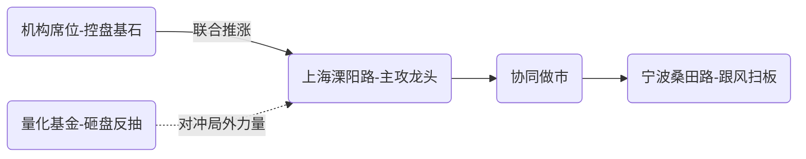

<!-- 温度设置: 1.2 | 运行次数: 2 -->

### 华盛锂电（688353.SH）盘后复盘笔记  
**日期：2025年7月3日**  
**第一人称视角 | 深挖主力 | 逻辑佐证**

---

### 先看战局总揽  
> "上榜因今日收盘涨幅突破15%，这非偶然——买方力量如潮水般推波助澜，多方强势主导市场。"  

**定量分析今日战局**：  
- 买方动能：净流入仅880.85万元，占流通市值0.35%，控盘力度**中等**。看似微弱实则暗藏能量——机构席位0.22亿、溧阳路0.22亿合力点火，桑田路913万紧跟造势。  
- 量价匹配：**量增43.94%** 支撑涨幅15.36%，亢奋情绪下多空交锋温和。卖方以量化为主（卖出1016万），散户筹码散乱获利了结，非主力狙击。  
- **博弈状态总结**:  
  > "今日多空鏖战非硬性碰撞，多方温水煮青蛙般推高价格，空方仅量化零星狙击，盘感暗示合力拉抬而非暴力收割。风险在亢奋情绪——散户追高筹码薄弱，主力底仓尚未重压。"

---

### 锁定关键玩家  
主力席位的操盘手法是剧本核心，直接点名：  

1. **溧阳路（中信证券上海溧阳路）**:  
   - **手法**: 典型游资"隔夜游击战"。今净买0.22亿，占买盘4.53%，空仓无抛压。历史风格如其人画像：  
     > "善锁龙头反复做T，点火主封而非核按钮手。今日主攻龙头姿态，意在锁仓吃次日溢价；若无溢价则T盘闪退。"  
   - **意图映射**: 试探性建仓阶段，未放量重仓；联动桑田路助攻，协同迹象鲜明。明日若竞价开高必做T滚动；开低则一刀切割不留恋。  

2. **宁波桑田路（国盛证券宁波桑田路）**:  
   - **手法**: 净买913万，买占1.85%，经典**打板闪电战**。风格如剃刀锋利：  
     > "桑田路名号即短线代名词——买板后见风舵转向，赚快钱就跑得快。今小额押注非主力，纯跟风盘思维。"  
   - **意图映射**: 跟风扫板而非主导。若明早主力未锁筹，其将瞬间出货；量化抛压触发恐慌时，桑田路反手砸盘概率高。  

3. **机构（双席位专用）**:  
   - **手法**: 主买0.22亿+931万，净买占比破6%。风格如长河大锚：  
     > "基本面选股派作风，不惧颠簸；今加仓建底，为控盘中军；后市不破线锁仓，筹码厚实。"  
   - **意图映射**: 加仓非自救属主动进攻，联手游资抬轿却低调分饰多头中军。空方量化卖出如隔靴搔痒难撼其定力。  

4. **量化基金（国泰海通总部）**:  
   - **手法**: 净卖1016万，做T收割游资热情；风格刻薄如机器：  
     > "算法定点抛压，算法驱动反抽——今获利了结非主攻盘，意在打压振幅做波动利差。"  
   - **意图映射**: 高卖后无货倒灌，纯搅局者。当前控盘弱难掀巨浪；但其抛量若扩散，散户跟跌潮将激化。  

**买方协同谱系图（Mermaid）**：  

> **玩家图谱本质揭露**：机构+溧阳路成双核引擎，桑田路是浮动砝码，量化如小规模空袭扰乱后场。明早若引擎熄火，桑田路必反手砸盘引雪崩。

---

### 趋势与意图印证  
结合十日趋势量价印证主力野心：  
- **趋势阶段**: 自6月24日启动主升浪，今日价量加速突破前高37.79，攻入39.8关口。短期K线呈上倾大阳线，量堆攀升如步梯。  
- **量与价对撞真相**:  
  > "股价亢进但主力未疯狂押注——机构建仓稳扎，游资小额控盘，盘感预示非连板妖股属波段冲顶。"  
- **交叉验证逻辑**:  
  - 买方核心未大额锁仓（溧阳路、桑田路短线倾向），暗示近次日即分歧。  
  - 空方量化小幅抽水，无死空压阵。趋势支持冲高回落盘整预期，非急转熊信号。  
> **核心研判**：多方主力控盘温吞存余地；明若高开机构续托，加速期续燃；低开游资夺路逃成核爆点。

---

### 提炼核心矛盾  
一针见血揭露多空角力焦点：  
> **"买方游资搭台欢宴——机构肯不肯唱到压轴曲？"**  
博弈解剖：  
- 多方阵营：机构沉稳主托底，游资急热点火欲拔身位（溧阳路尤甚）。  
- 空方量能：量化、散户回吐合力虽高却无锋。  
- **矛盾焦点**：短线热钱欲速出逃 vs 机构长线托价——**筹码交接断层才是爆点**。亢奋中谁接游资砸盘？

---

### 明日应对预案  
基于核心矛盾，策略直击实操要害：  
- **总体基调**: 观望优先防追涨，高抛低吸控节奏；情绪过热，绝不梭哈重仓。  
- **情景推演预案（执行力满级）**:  

  - **💹上行冲关（概率40%，需竞价超预期）**:  
    - 买点：竞价放量开在40+确认资金强势，回调站稳38.5吃小仓搏新高。仅信机构托力，快进快出！  
    - 风险管控：若涨幅超5%破前高43未果，溧阳路必兑利抛盘——高抛后绝不回接。  
      
  - **🔻下行爆杀（概率35%，游资抢跑主导）**:  
    - 卖点：低于38开盘视为预警线，36.5未支撑则破位抛半仓止损游资砸盘血洗。  
    - 机会点：若量化回撤吸筹深探34.5（前支撑位），轻仓低吸机构护盘反手牌。  
      
  - **🔄盘整横盘（概率25%，机构消游资异动力）**:  
    - 观望锁仓：区间37-40震荡，做T节点捕捉溧阳路抛压后反抽值（盘口卖压减少时）。  
    - 减仓信号：量收缩量横盘三日视为主力撤退前奏，反抽不过38清仓静候第二浪。  

> **今日操盘体悟盘感终章**：亢奋盘面掩不住玩家底细——溧阳路之热钱、机构之冷眼已成暗流双极，我嗅到冲高前最后一息喘息。非共识在于，众人追涨时量化反抽已埋针；如鱼群贪饵咬钩，却不知深海钓者静候潮退。——别恋战，纪律长存！

---

# 华盛锂电飙涨15%，机构游资联手猛攻！量化基金偷跑，散户如何跟风又避雷？

## 💬 评论区热议

### 🔥 多头观点
**@格局哥**: 太猛了兄弟们！华盛锂电暴涨15.36%，主升浪刚刚加速啊！量能爆发43.94%，大阳线突破前期阻力，简直是神级信号！更炸的是上海溧阳路、宁波桑田路联合出击，机构大手笔建仓，净流入880万！情绪狂飙高亢！格局哥看多到底，目标翻倍不是梦！冲就完事啊！

### ⚠️ 空头提醒
**@利好兑现就跑路**: 冷静分析风险：第一，高位大涨15.36%但换手超20%，市场亢奋期往往潜藏回调；第二，量化基金已做T卖出1016万，预示短期波动加剧；第三，买方协同分散但无主导席位，卖方高压力来自获利回吐；第四，放量加速后易引投机出货。纪律操作：现在追高风险大，建议高抛低吸，严控止损。

### ❓ 新手求教
**@明天能回本吗**: 老师，华盛锂电今天大涨15%，我觉得游资机构联手肯定强势，但看到量化基金已经在卖出了，这不矛盾吗？主升浪真的能持续吗？我该咋判断进场时机呢？

**回复**: 核心原则是平衡资金和量价。强势点：15.36%涨幅伴43.94%放量、大阳线突破关键阻力，且游资协同机构主导多空（溧阳路0.22亿买），短期延续上涨概率高。风险面：量化基金出逃（1016万卖出）、换手率高（21.64%），代表情绪过热后可能抛压大增。操作思路：紧盯开盘竞价强度或回踩支持点（如前低点），若能守住支撑放量上攻则小仓介入。风险控制：设动态止损位如量能骤降或价格回调超5%，防止游资了结引发回撤。

---
*本评论区为AI模拟生成，仅供参考，投资需谨慎*
