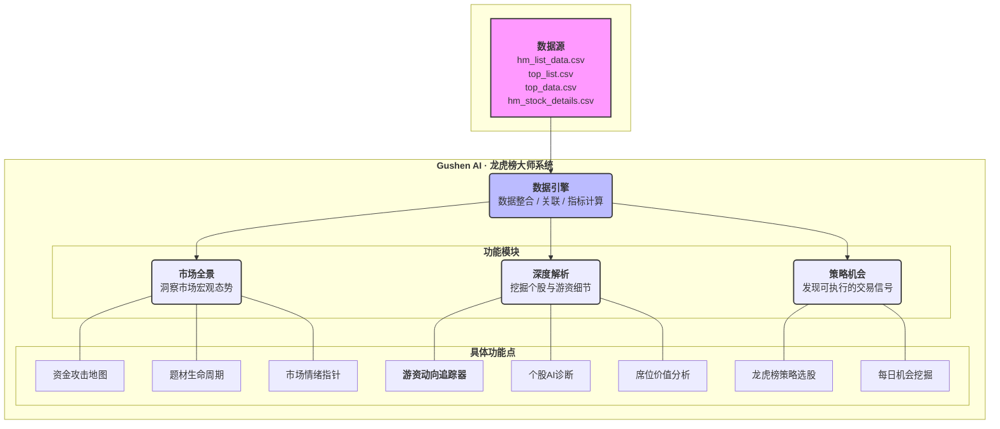

# Gushen AI · 龙虎榜大师系统设计

## 核心使命
将龙虎榜数据从"信息"转化为"情报"，再从"情报"提炼为"策略"，真正赋能散户投资者。

## 数据依赖
本系统依赖于每日更新的四份核心数据表：
- `hm_list_data.csv`: 游资名人录，定义市场上主要玩家的身份、风格和席位。
- `top_list.csv`: 每日龙虎榜新闻头条，记录当天市场焦点的上榜股票。
- `top_data.csv`: 详细战报，揭示每个上榜个股的买卖双方营业部及交易金额。
- `hm_stock_details.csv`: 特定战报精编，关联游资与具体交易，是数据引擎每日需要生成的核心中间产物。

## 系统架构图

---

## 一、 数据引擎 (Data Engine) - 系统的心脏

这个模块是后台核心，用户不可见，但至关重要。它每天自动处理您提供的四份数据。

1.  **数据整合与关联**：
    *   **游资-席位映射**：核心步骤是将 `hm_list_data.csv` (游资) 和 `top_data.csv` (交易数据) 通过`营业部名称`关联起来。这样，我们就知道每一笔交易背后的操盘手是谁，是"赵老哥"还是"方新侠"。`hm_stock_details_20250616.csv` 文件就是这个步骤的结果示例。
    *   **股票-榜单关联**：将 `top_list.csv` (上榜个股) 和 `top_data.csv` (交易细节) 通过股票代码关联，形成完整的个股上榜档案。
2.  **核心指标计算**：
    *   **席位强度 (Seat Strength)**：基于历史数据，给每个营业部打分。如果一个席位买入的股票后续上涨概率高，则得分高。
    *   **游资协同性 (Synergy Score)**：分析哪些"明星游资"经常同时出现在同一只股票上，形成"游资军团"的识别。

---

## 二、 市场全景 (Market Panorama) - 洞察先机

这个模块为用户提供一个宏观的、鸟瞰式的市场视图，帮助用户感知水温、把握方向。

*   **1. 资金攻击地图**: 通过板块热力图，直观展示今天主力资金的主攻方向。
*   **2. 题材生命周期**: 追踪热点题材的资金流入流出情况，判断题材发展阶段。
*   **3. 市场情绪指针**: 综合计算"机构净买入额"、"游资活跃度"、"涨停股数量"、"炸板率"等指标，最终生成一个0-100的"**龙虎榜市场情绪分**"。高分代表市场情绪亢奋，风险偏好高；低分则代表情绪低迷，应以谨慎为主。

---

## 三、 深度解析 (In-depth Analysis) - 细节是魔鬼

这是系统的核心价值所在，提供对"个股"和"游资"的深度挖掘。

*   **1. 游资动向追踪器 (Hot Money Tracker)**:
    *   **明星游资档案页**：为 `hm_list_data.csv` 里的每一位游资建立一个专属页面，包含：
        *   **风格标签**：从`desc`字段提炼（如："高位接力"、"龙头锁仓"）。
        *   **常用席位**：列出其所有`orgs`。
        *   **最新操作**：展示其最近的买卖记录 (来自`hm_stock_details`)。
        *   **战绩统计**：成功率、平均持股周期、历史代表作。 （这个可以从过去60个交易日的数据中自己计算获取）
        *   **操作日历**：在日历上标记其出手日期，形成行为热图。
*   **2. 个股AI诊断**:
    *   当用户点击`top_list.csv`里的任一股票，系统会生成一份诊断报告：
        *   **龙虎榜快照**：清晰展示买卖双方前五席位的名称、金额、净额。
        *   **席位透视**：AI自动识别每个席位是"机构"、"量化基金"还是"知名游资"，并标注其"席位强度分"。
        *   **多空力量对比**：分析是"强强对话"还是"机构出逃游资接盘"。
        *   **AI智能解读**：自动生成三段式回复（机会、风险、策略），将复杂的榜单数据翻译成普通人能懂的语言。

---

## 四、 策略机会 (Strategy & Opportunities) - 将情报转化为生产力

这个模块的目标是最高阶的：直接为用户提供可执行的交易思路。

*   **1. 龙虎榜策略选股器**:
    *   提供一个强大的筛选工具，让用户可以像搭乐高一样组合自己的选股条件。例如：
        *   `[游资A]` **和** `[机构专用]` **今日共同买入** 的股票。
        *   **连续3天** 净买入额 **持续增加** 的股票。
        *   买方前5名 **席位强度分均>80** 的股票。
*   **2. 每日机会挖掘**:
    *   系统每天收盘后，自动运行几种经典的高胜率模型，并推送给用户。例如：
        *   **"机构游资共振"名单**：筛选出机构和顶级游资合力买入的个股。
        *   **"龙头首阴"关注池**：发现强势龙头股首次回调时，仍有实力游资在低吸的标的。
        *   **"假机构"识别**：通过分析历史操作行为，识别出那些伪装成机构席位的游资，并提醒风险。 

---

## 五、各功能点技术实现划分 (Code vs. LLM)

为了清晰地指导开发，这里将上述功能点分解为「代码实现」和「LLM赋能」两部分。

### **第一部分：数据引擎 (100% Code)**

整个数据引擎是系统的基石，完全由代码实现，负责数据的ETL和指标计算，为上层应用提供高质量、结构化的数据。

- **实现方式**: Python (Pandas/Polars) + SQL/数据库。
- **职责**:
    1.  **数据整合与关联**: 执行确定性的表格Join操作，将游资、席位、个股、榜单数据关联成`hm_stock_details`这样的核心中间表。
    2.  **核心指标计算**: 实现所有量化指标的算法，如席位强度分、游资协同分。这些是固定的数学或统计模型。

### **第二部分：市场全景 (Code计算 + LLM解读)**

这个模块负责将数据转化为宏观洞察，代码负责"算什么"和"画什么"，LLM负责"这是什么"和"为什么"。

1.  **资金攻击地图**
    - **Code 实现**:
        - 按板块/概念对每日资金进行聚合统计。
        - 生成热力图的数值矩阵。
        - 前端负责将数值矩阵渲染成可视化图表。
    - **LLM 赋能**:
        - **输入 (Context)**: 当日资金流入最高的Top 5板块及其资金量、近期相关政策/新闻。
        - **输出 (解读)**: 生成一段"市场主线分析"，例如："今日资金主要攻击了**光伏设备**和**AI芯片**板块，前者可能受...政策影响，后者则因为...事件催化，市场主线清晰。"

2.  **题材生命周期**
    - **Code 实现**:
        - 追踪特定题材（如"低空经济"）连续N日的资金净流入/流出数据。
        - 计算题材的趋势指标（如斜率、拐点）。
        - 绘制生命周期曲线图。
    - **LLM 赋能**:
        - **输入**: 某题材的连续资金流数据、当前所处阶段的算法判别结果（如：导入期、成长期、衰退期）。
        - **输出**: 对题材阶段进行定性描述和策略建议。例如："**低空经济**题材连续3日资金净流出，已从成长期进入衰退期，风险加大，不宜追高。"

3.  **市场情绪指针**
    - **Code 实现**:
        - 分别计算构成情绪分的各个子指标（机构净买入、炸板率等）。
        - 按照预设权重，加权计算出最终的0-100情绪分。
    - **LLM 赋能**:
        - **输入**: 最终情绪分（如75分）以及贡献最大的几个子指标（如"机构净买入+10分，炸板率-5分"）。
        - **输出**: 生成一段可读性强的市场情绪诊断。例如："今日龙虎榜市场情绪75分，处于**较为乐观**区间。主要驱动力来自**机构大幅净买入**，但**较高的炸板率**也提示市场存在一定分歧，建议谨慎乐观。"

### **第三部分：深度解析 (Code获取数据 + LLM分析)**

这是人机结合最紧密的部分，代码负责精准提取结构化数据，LLM负责将冰冷的数据转化为有温度、有深度的分析。

1.  **游资动向追踪器**
    - **风格标签**:
        - **LLM 赋能**: 将 `hm_list_data.csv` 中某游资的`desc`字段作为输入，要求LLM提炼出3-5个核心风格标签（如："龙头锁仓", "一日游", "趋势加速"）。Code负责存储和展示这些标签。
    - **其他功能 (常用席位、最新操作、战绩统计、操作日历)**:
        - **Code 实现**: 100%由代码实现。这些都是对`hm_stock_details`等表格进行直接的查询、统计和可视化。

2.  **个股AI诊断**
    - **龙虎榜快照**:
        - **Code 实现**: 100%由代码实现。从`top_data`表中查询并展示买卖双方数据。
    - **席位透视**:
        - **Code 实现**: 识别席位是"机构"、"游资"还是"普通营业部"（通过与`hm_list_data`关联），并查询出其"席位强度分"。
        - **LLM 赋能**: 对特殊席位进行补充解读。例如，输入"[方新侠]的席位今天买了"，LLM可以补充"方新侠是顶级游资，以格局和锁仓闻名，他的买入往往意味着对中期趋势的看好。"
    - **多空力量对比**:
        - **Code 实现**: 准备好结构化数据，例如：`{买方: [{角色: '知名游资', 名称: '赵老哥', 金额: 8000万, 强度: 92}, {角色: '机构', ...}], 卖方: [...]}`。
        - **LLM 赋能**: 将上述结构化数据作为Context，让LLM进行分析。输出："多空力量分析：买方由**知名游资赵老哥**和**一家机构**主导，合计买入1.2亿，力量强劲。卖方最主要的是**XX证券散户大本营**，抛压相对分散。综合判断，**多方占据明显优势**。"
    - **AI智能解读**:
        - **LLM 赋能**: 100% LLM。这是整个功能的核心，将前几步获取的所有结构化信息（快照、席位分析、力量对比）全部打包作为Context，然后使用一个精心设计的Prompt，让LLM生成最终的（机会、风险、策略）三段式报告。

### **第四部分：策略机会 (Code筛选 + LLM包装)**

这个模块让策略的发现和呈现更高效、更易懂。

1.  **龙虎榜策略选股器**
    - **Code 实现**: 100% Code。这是一个纯粹的前端UI+后端查询的筛选功能，不涉及LLM。用户的所有筛选条件都将转化为对数据库的确定性查询语句。

2.  **每日机会挖掘**
    - **Code 实现**:
        - 编写并执行多个固定的、高胜率的选股策略脚本（如："机构游资共振"、"龙头首阴"）。
        - 每日盘后自动运行，筛选出符合条件的股票列表。
    - **LLM 赋能**:
        - **输入**: 股票代码，以及它被哪个策略模型命中。
        - **输出**: 将结果"包装"成一条吸引人的机会推送。例如，对于策略"机构游资共振"命中的"XX股份"，LLM可以生成："**机会挖掘：机构与游资达成共识！** 今日知名游资 **作手新一** 与 **两家机构** 合计买入XX股份1.5亿元，形成强大攻击合力，值得高度关注。" 