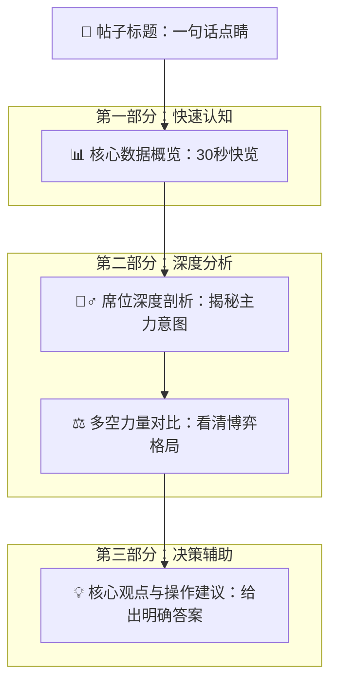

# Gushen AI 龙虎榜分析引擎 - 产品需求文档 (PRD)

> **版本**: 1.0
> **负责人**: Cline (Gushen AI 产品设计专家)
> **目标**: 定义如何将原始龙虎榜JSON数据转化为面向A股散户的高质量、可操作性分析内容，并形成标准化的内容生产流程。

---

## 1. 核心理念：从“数据解读”到“决策辅助”

传统的龙虎榜解读停留在罗列数据和描述现象，散户看完依然困惑：“很厉害，但我该怎么办？”

**Gushen AI的核心价值主张是跨越这一鸿沟，我们的目标不是“解释数据”，而是“辅助决策”。**

我们将遵循以下三大核心原则：

1.  **用户中心 (User-Centric)**：一切分析都必须围绕散户的核心痛点展开——**“看不懂、不敢买、不会卖、拿不住”**。
2.  **AI原生 (AI-Native)**：利用AI的推理、总结和多维分析能力，从数据中挖掘出人类分析师难以发现的深层逻辑和博弈关系。
3.  **教育赋能 (Education-Empowering)**：不仅给出“鱼”（操作建议），更要授人以“渔”（分析逻辑），帮助用户在潜移默化中提升自身的投资认知。

---

## 2. 目标用户画像 (Target Audience)

-   **群体**: 中国A股市场的散户投资者。
-   **经验**: 从入市不久的菜小白到有一定经验但仍感困惑的老韭。
-   **痛点**:
    -   **信息过载**: 面对海量数据，不知从何看起。
    -   **知识壁垒**: 无法理解“知名游资”、“量化基金”等席位背后的深层含义和操作风格。
    -   **情绪驱动**: 容易被市场情绪左右，追涨杀跌。
    -   **决策困难**: 缺乏将信息转化为具体买卖操作的能力。
    -   **风险意识薄弱**: 对潜在的风险和“坑”缺乏识别能力。

---

## 3. 内容生产设计：从数据到“帖子”的转化漏斗

我们将设计一个标准化的分析框架，将每一支上榜股票的原始JSON数据，转化为一篇结构清晰、逻辑连贯、价值明确的分析帖子。

### 3.1. 单篇帖子核心结构 (Post Structure)

每篇个股分析帖子将包含以下五大模块，层层递进，引导用户从宏观到微观，从现象到结论，最终落实到操作。

### 3.2. 各模块内容设计详解

#### **模块一：帖子标题 (Post Title)**

-   **原则**: 一句话点明核心看点，激发阅读兴趣。
-   **格式**: `【标签】股票名称 + 核心事件/结论`
-   **标签示例**: `[游资激战]`, `[机构抢筹]`, `[量化砸盘]`, `[多空分歧]`
-   **标题示例**:
    -   `[游资激战] 红太阳：成都系携手神秘资金强力封板，后市怎么看？`
    -   `[机构砸盘] 信立泰：四大机构席位集体出逃，风险还是机会？`
    -   `[多空分歧] 泰山石油：高换手下机构与游资激烈换手，谁主沉浮？`

#### **模块二：核心数据概览 (Key Data Overview)**

-   **原则**: 可视化、易于理解，让用户在30秒内掌握基本盘。
-   **内容**:
    1.  **上榜理由**: `日涨幅偏离值达到7%`
    2.  **股价表现**: `收盘价: 9.03元`, `涨跌幅: +9.99%`
    3.  **市场热度**: `换手率: 16.46%`, `成交额: 14.59亿元`
    4.  **龙虎榜资金**: `总买入: 2.37亿元`, `总卖出: 1.09亿元`, **`净买入: 1.28亿元`**
    5.  **AI一句话点评**: 基于净买入额、买卖双方力量对比，给出一个初步的、概括性的评价。
        -   *示例（红太阳）*: “知名游资主导买方，买入力量远超卖方，市场做多意愿强烈。”
        -   *示例（泰山石油）*: “买卖双方金额接近，多空分歧较大，机构与游资互道“SB”。”

#### **模块三：席位深度剖析 (Seat Deep-Dive)**

-   **原则**: 揭示“谁在买，谁在卖”，并解读其背后的动机和潜在影响。这是整个分析的核心。
-   **分析维度**:
    1.  **买方阵营 (Top 5 Buy Seats)**:
        -   **识别主力**: 找出买一、买二等核心席位，特别是 `player_info` 中有明确身份的“知名游资”或“机构专用”。
        -   **解读风格**: 结合 `player_info` 中的描述和风格（如“成都系”、“温州帮”、“量化基金”），解读其历史操作习惯。
            -   *示例（红太阳的成都系）*: “买三席位‘成都系’是知名超短游资，擅长做首板，但次日有冲高砸盘的习惯，需要警惕其短线套利行为。”
        -   **分析协同性**: 判断买方席位之间是否存在协同作战的可能（如多个席位属于同一派系或风格相似）。
        -   **评估锁仓意愿**: 分析席位的买卖行为（如是否做T），判断其持仓意愿是长是短。
    2.  **卖方阵营 (Top 5 Sell Seats)**:
        -   **识别砸盘元凶**: 找出主要的卖出席位，分析其卖出意图（获利了结、止损出局、还是做T）。
        -   **解读对手盘**:
            -   *示例（红太阳的T王）*: “卖方出现了‘T王’席位，说明有部分资金在进行日内交易，这对股价的稳定性有一定影响，但并未形成大规模抛压。”
            -   *示例（信立泰的机构）*: “卖方清一色为机构席位，且净卖出额巨大，表明机构对公司短期或中期走势存在较大分歧或看空，这是重要的风险信号。”
    3.  **神秘席位解读**: 对于“未知机构”或“普通席位”，可根据其地理位置、券商分公司特点等进行初步推测，或直接标注为“神秘资金”，增加解读的趣味性。

#### **模块四：多空力量对比 (Force Analysis)**

-   **原则**: 从“点”（单个席位）的分析，上升到“面”（整体格局）的分析。
-   **分析维度**:
    1.  **资金净流向**:
        -   **榜上净额**: `net_amount` (1.28亿元) - 这是最直观的多空指标。
        -   **买方集中度**: 计算买方前五名合计占总成交额的比例 (`amount_rate`)，比例越高，说明主力控盘意愿越强。
        -   **卖方集中度**: 计算卖方前五名合计占总成交额的比例，判断抛压是否集中。
    2.  **席位性质对比**:
        -   **游资 vs 机构**: 分析买卖双方是游资主导还是机构主导。
            -   *游资主导*: 通常意味着短线情绪和波动性较高。
            -   *机构主导*: 通常意味着更看重基本面和中长期逻辑。
        -   **长线 vs 短线**: 综合席位风格，判断当前是长线资金建仓还是短线资金博弈。
    3.  **结合K线图 (`historical_data`)**:
        -   **位置判断**: 当前涨停/异动是发生在长期底部、上涨中继还是高位？
            -   *底部放量涨停，游资抢筹*：可能是启动信号。
            -   *高位巨量换手，多空分歧*：警惕见顶风险。
        -   **历史关联**: 查看历史龙虎榜，判断这些席位是否是“老面孔”，是反复做T还是首次建仓。

#### **模块五：核心观点与操作建议 (Conclusion & Suggestion)**

-   **原则**: 严格遵循“直接回答、知识传授、风险提醒”的三层次模型。
-   **内容结构**:
    1.  **【核心观点】(The Point)**: 用一两句话给出最核心、最明确的结论。
        -   *示例（红太阳）*: “**核心观点：** 知名游资‘成都系’主导的短线进攻信号明确，买方力量占据绝对优势，短期仍有上冲动能，但需警惕次日短线资金获利了结带来的波动。”
    2.  **【操作建议】(Actionable Advice)**: 给出具体的、可执行的建议，满足不同风险偏好的用户。
        -   **激进型**: “可于次日开盘后，若股价强势，在分时均线附近轻仓试错，博取短线溢价。”
        -   **稳健型**: “建议保持观望。等待该股经历短线资金的获利了结和换手后，若能在XX元附近企稳，再考虑介入。”
        -   **持有者**: “若已持仓，可考虑在次日冲高时分批止盈，降低仓位，锁定利润。”
    3.  **【风险提示】(Risk Warning)**: 明确告知潜在的风险点。
        -   “⚠️ **注意：** ‘成都系’游资有次日砸盘的习惯。如果次日开盘不及预期，或盘中跌破XX关键位，应视为走弱信号，严格执行止损纪律。”
        -   “⚠️ **声明：** 本分析仅为基于公开数据的AI解读，不构成任何投资承诺。股市有风险，入市需谨慎。”

---

## 4. 自动化与迭代

此PRD旨在构建一个标准化的内容生产框架。下一步，我们可以：

1.  **开发Agent**: 基于此框架，开发专门的AI Agent，实现从JSON到分析帖子的自动化生成。
2.  **建立反馈闭环**: 追踪帖子发布后的用户互动（点赞、评论、阅读时长）和次日股价表现，将这些数据作为Agent模型迭代优化的重要输入。
3.  **持续优化**: 根据市场风格的变化和用户反馈，不断迭代和优化分析框架和解读模型。

通过以上设计，Gushen AI将不仅仅是一个数据展示工具，而是一个能够深度赋能散户投资者的智能决策伙伴。
